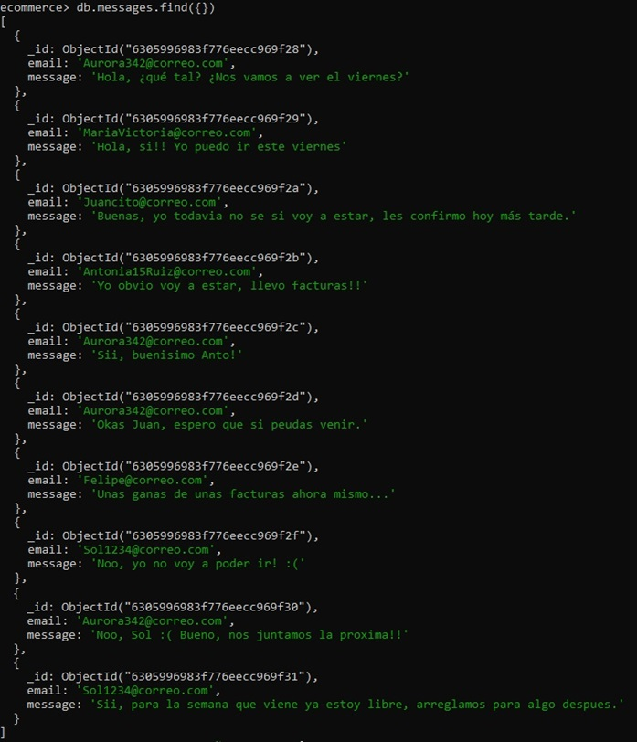

<h1 align="center">Base de datos en <em> MongoDB </em></h1>

Crear base de datos ecommerce que tenga las colecciones mensajes y productos:

Agregar 10 documentos a las colecciones mensajes y productos:

Listar los documentos de cada colección:

Cantidad de documentos almacenados en cada colección.

<em>CRUD:</em>

Agregar producto a productos

<em>Consultas:</em>

1. productos precio menor a 1000

2. productos precio entre 1000 y 3000

3. productos precio mayor a 3000

4. producto más barato

en la consigna pedia tercer producto más barato, pero lei mal y ya borré los más baratos. El comando en el caso de la consigna seria:

<em>db.products.find().sort({price:1}).skip(2).limit(1)</em>

Agregar stock a todos los productos

Cambiar stock de productos con precio mayor a 4000

Borrar productos con precio menor a 1000

